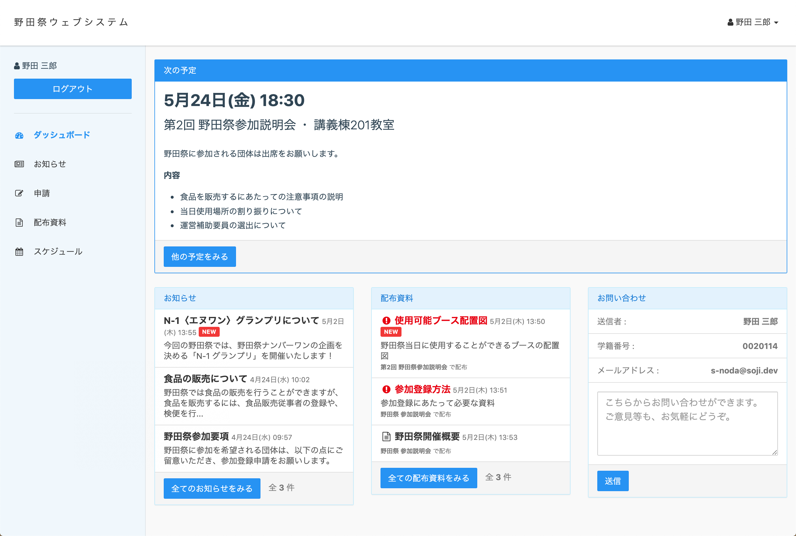

<h1 align="center">inaka-portal</h1>

大学祭運営支援ウェブシステム

---

---

**inaka-portal** (イナカ・ポータル) は、大学祭実行委員会の業務を効率化するフリーのソフトウェアです。

大学祭実行委員会の業務では、パンフレット掲載内容の申請や大学提出書類の提出受付など、参加団体からの申請の取りまとめが多く発生します。多くの大学祭では紙やメールによる申請受付を行なっており、これらの業務は非常に大きな手間となっていました。

inaka-portal を利用することで、各種申請をウェブで受け付けることができます。また、 **集まった申請は Excel ファイルに書き出すことができる** ため、今まで必要となっていた作業の多くを効率化することができます。

そのほかにも、inaka-portal では、

- 配布資料のダウンロードサービスの提供
- お知らせ機能
- 参加団体向け会議告知

などを簡単に行うことができます。

inaka-portal は、PHP と MySQL が使えるレンタルサーバーで稼働させることができます。

もともと、 [東京理科大学 野田地区理大祭実行委員会](https://nodaridaisai.com) の内部で開発されました。

## 機能
### 参加団体向け
- ユーザー登録・ログイン機能
- 各種申請の提出
- 配布資料のダウンロード
- スケジュールの確認
- 実行委員会へのお問い合わせ

など

### 実行委員会向け
- 登録されているユーザー情報の確認
- 参加団体・出展企画の管理
- 申請フォームの作成・管理
- 申請フォーム回答を Excel に出力 (CSV エクスポート)
- 配布資料をダウンロード用に登録
- スケジュールの管理
- お問い合わせを LINE で受け取る (LINE Notify を利用)

など

## ライセンス

MIT License
