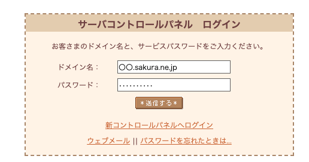
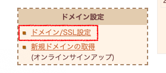
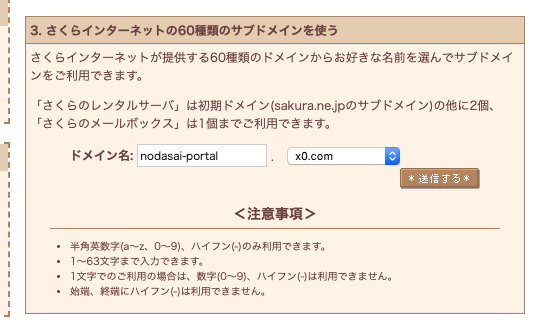
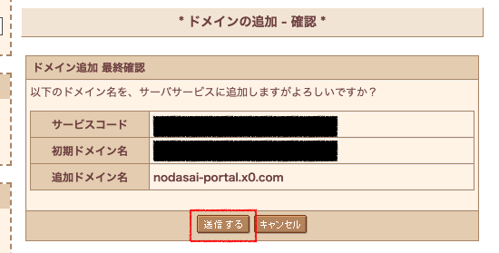
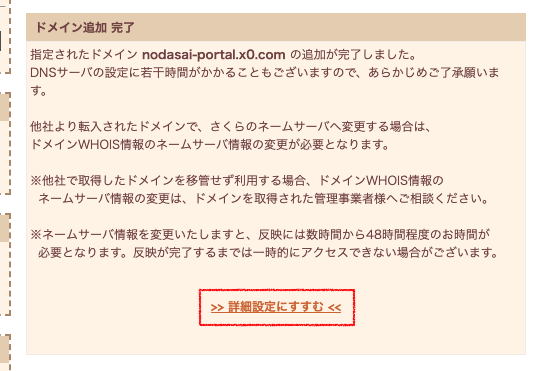
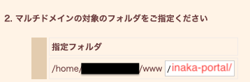
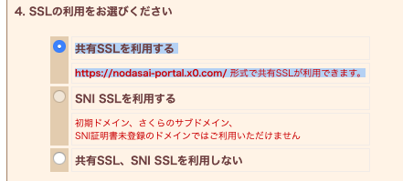

# 「さくらのレンタルサーバー」にインストール

## 前提
「さくらのレンタルサーバー」にインストールするには、あらかじめ PC に以下のソフトウェアがインストールされている必要があります。

- SSH 接続できるターミナル
    - 最新の Windows 10 であれば、コマンド プロンプトでも SSH コマンドを利用できるかと思います。
    - Mac の「ターミナル」は標準で SSH 接続できます。
    
また、さくらのレンタルサーバーの **スタンダードプラン以上** に契約している必要があります（ライトプランではご利用になれません）。

## 0. さくらのレンタルサーバーに申し込む
まだ「さくらのレンタルサーバー」をレンタルしていない場合は、以下の URL より申し込んでください。

なお、inaka-portal を動作させるためには **スタンダードプラン** 以上である必要があります。

https://www.sakura.ne.jp/

## 1. さくらのレンタルサーバーのコントロールパネルにログイン
https://secure.sakura.ad.jp/rscontrol/ にアクセスし、さくらのレンタルサーバーに申し込んだ後に送信されるメールの案内にしたがって、コントロールパネルにログインしてください。



## 2. ドメイン(inaka-portal の URL)を作成する
※ ドメインについて詳しくない方向けの説明になります。

ログイン後、ページを下の方にスクロールすると、「ドメイン設定」という項目が左側にあります。その中の、「ドメイン/SSL設定」を選択してください。



その後、赤い「 **新しいドメインの追加** 」というボタンをクリックしてください。

「新しいドメインの追加」というページになりますので、「 **3. さくらインターネットの60種類のサブドメインを使う** 」で、お好きな URL を設定してください。

わかりやすく覚えやすい URL を設定されることをお勧めします。



確認画面が表示されますので、「 **送信する** 」をクリックしてください。



これで URL が作成できました。「 **詳細設定にすすむ** 」をクリックしてください。



## 3. ドメインの詳細設定を行う

「詳細設定にすすむ」をクリックすると、ドメインの詳細設定画面が表示されます。もし、「詳細設定にすすむ」をクリックしなかった場合、再度、ページ左側のメニューから「ドメイン/SSL設定」を選び、先ほど設定したURLの一番右側にある「変更」をクリックしてください。

### 3.1. 「マルチドメインの対象のフォルダをご指定ください」を変更する

inaka-portal をインストールする対象のフォルダを設定できます。 `/inaka-portal/` と入力してください。

(先頭と末尾の `/` (スラッシュ) は忘れないよう注意してください)



### 3.2. 「SSLの利用をお選びください」を変更する

「 **共有SSLを利用する** 」という文字の左にある○をクリックしてください。



### 3.3. 「送信」をクリックする

以上の設定を反映させるために、ページ下の方の「 **送信** 」というボタンをクリックしてください。

## 4. SSH でサーバーに接続する
OS 標準のターミナル(Windows : コマンド プロンプト、macOS : ターミナル)を開き、次のコマンドを実行してください。

```bash
$ ssh [初期ドメインのサブドメイン]@[初期ドメインのサブドメイン].sakura.ne.jp
```

(先頭の `$` は入力不要です)

レンタルサーバーの初期ドメインが、 `example.sakura.ne.jp` であれば、

```bash
$ ssh example@example.sakura.ne.jp
```

を実行してください。

初回アクセス時、アクセスしても良いかを尋ねる確認メッセージ(英語)が表示されますので、 `yes` と入力して <kbd>Enter</kbd> キーを押してください。

その後、パスワードの入力を求められます。コントロールパネルにログインするときに使用したパスワードと同じものを入力して <kbd>Enter</kbd> キーを押してください。

(入力中、パスワードは画面に表示されませんが、正常に入力できています)

## 5. ログインシェルを bash に変更する
※ bash とは何かわからなくても大丈夫です。

SSH 接続できたら、以下のコマンドを実行してください。

```bash
$ chsh -s /usr/local/bin/bash
```

このコマンドを実行すると、パスワードの入力を求められますので、コントロールパネルにログインするときに使用したパスワードと同じものを入力して Enter を押してください。

ログインシェルの変更を反映するには、一度、SSH 接続を解除して、もう一度接続する必要があります。以下のコマンドを実行して、まず接続解除してください。

```bash
$ exit
```

その後、上記「SSH でサーバーに接続する」と同様の方法で SSH 接続を行い、以下のステップに進みます。

## 6. inaka-portal をサーバーにダウンロードする

以下のコマンドを 1 行ずつ実行してください。 **先頭の `$` は入力不要です。 `#` で始まる行は実行不要です。**

```bash
$ cd www/
$ git clone https://github.com/SofPyon/inaka-portal.git
```

**注意** - `cd www/` コマンドを実行した際にエラーが表示される場合、SSH 接続が切断されています。その場合、上記「SSH でサーバーに接続する」からやり直してください。

## 7. 